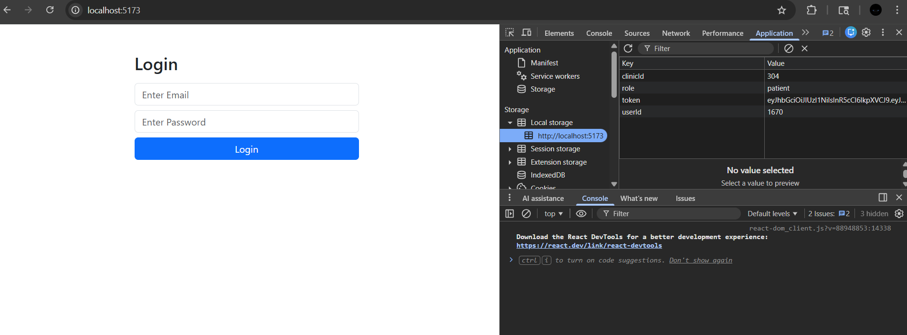
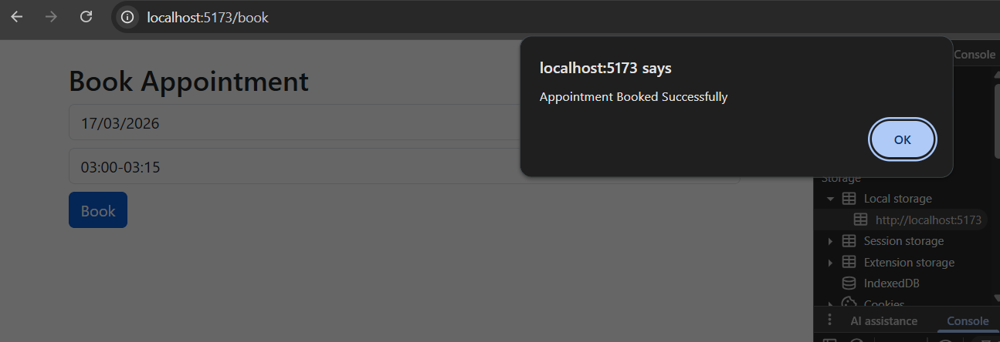
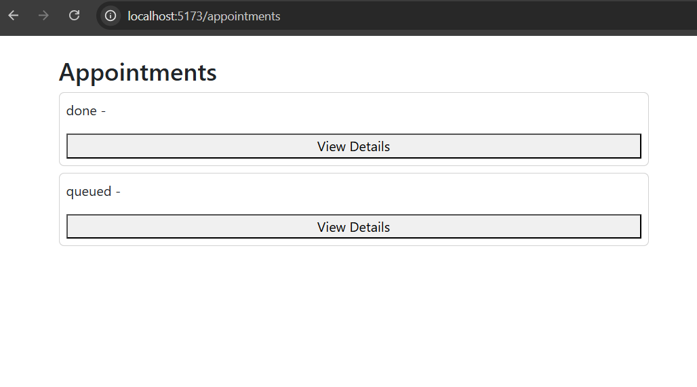
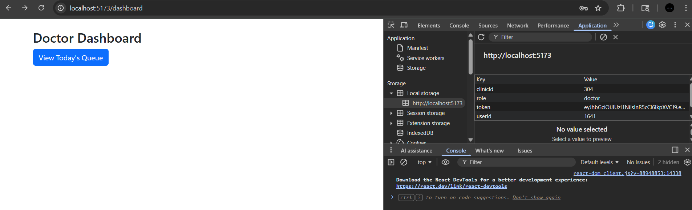
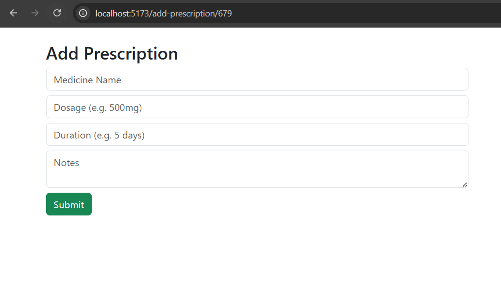

# 🏥 Clinic Management System (Frontend)

This is a React-based frontend for Clinic Management System using API from Sampaarsh.

---

## 🚀 Features

- 🔐 Login (Role-based: Admin, Patient, Doctor, Receptionist)
- 📅 Book Appointment
- 📋 View My Appointments
- 🧑‍💼 Queue Management (Receptionist)
- 👨‍⚕️ Doctor Panel (Prescription & Reports)
- 🏥 Admin Panel (Create Users)

---

## 🛠️ Tech Stack

- React (Vite)
- JavaScript
- Axios
- Bootstrap

---

## 🌐 API Base URL
# 🏥 Clinic Management System (Frontend)

This is a React-based frontend for Clinic Management System using API from Sampaarsh.

---

## 🚀 Features

- 🔐 Login (Role-based: Admin, Patient, Doctor, Receptionist)
- 📅 Book Appointment
- 📋 View My Appointments
- 🧑‍💼 Queue Management (Receptionist)
- 👨‍⚕️ Doctor Panel (Prescription & Reports)
- 🏥 Admin Panel (Create Users)

---

## 🛠️ Tech Stack

- React (Vite)
- JavaScript
- Axios
- Bootstrap

---

## 🌐 API Base URL
https://cmsback.sampaarsh.cloud


---

## 📸 Screenshots

### 🔐 Login Page
/auth/login  or /login




---

### 📅 Book Appointment
/book



---

### 📋 My Appointments
/appointments




---

### 👨‍⚕️ Doctor Panel
/dashboard



---

### 💊 Add Prescription
/add-prescription/:id



and etc.


## ⚙️ Setup Instructions

```bash
npm install
npm run dev
